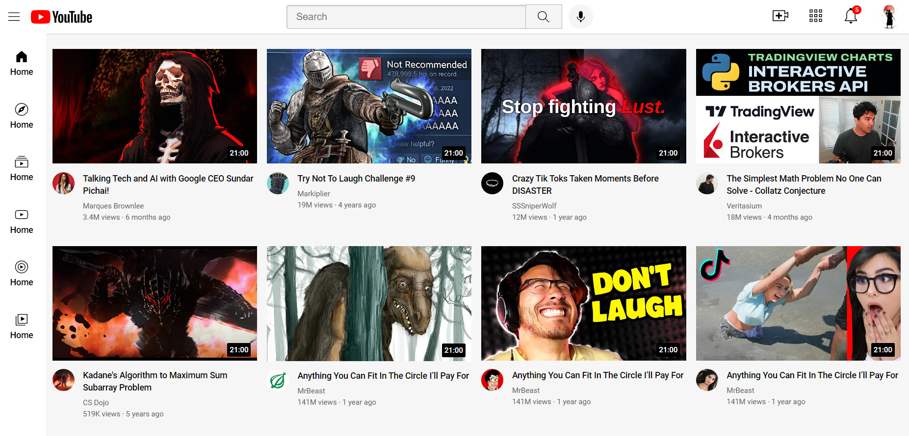

# YouTube Clone

This project is a simple clone of YouTube's layout, developed using only HTML and CSS. It replicates the basic look and feel of YouTube's UI without any JavaScript functionality, providing a responsive and visually similar interface.



## Table of Contents

- [Features](#features)
- [Project Structure](#project-structure)
- [Technologies Used](#technologies-used)
- [Getting Started](#getting-started)
- [Screenshots](#screenshots)
- [Future Improvements](#future-improvements)
- [Contributing](#contributing)
- [License](#license)

## Features

- **Responsive Layout**: The project adapts to different screen sizes.
- **Static Elements**: Header, sidebar, and video thumbnail grid layout.
- **Hover Effects**: Basic hover animations for interactive icons and buttons.

## Project Structure

```
.
├── index.html          # Main HTML file for the project
├── css
│   └── styles.css      # CSS file for styling
└── images              # Folder containing images and icons
```

## Technologies Used
- **HTML5**
- **CSS3**

## Getting Started

To view the project locally, follow these steps:

1. Clone this repository:
   ```
   git clone https://github.com/your-username/youtube-clone
   ```

2. Open the project folder:
   ```
   cd youtube-clone
   ```

3. Open `index.html` in your web browser to view the site.

## Future Improvements

- **JavaScript Interactivity**: Adding functionality for dynamic actions like video playback, like/dislike, and subscribe buttons.
- **Additional Pages**: Extending the project with other YouTube pages like "Trending" or "Subscriptions."
- **Enhanced Responsiveness**: Improve layout for a wider range of devices.

## Contributing

1. Fork the repository.
2. Create a new branch:
   ```
   git checkout -b feature-branch
   ```

3. Commit your changes:
   ```
   git commit -m "Add new feature"
   ```

4. Push the branch:
   ```
   git push origin feature-branch
   ```

5. Open a pull request.
